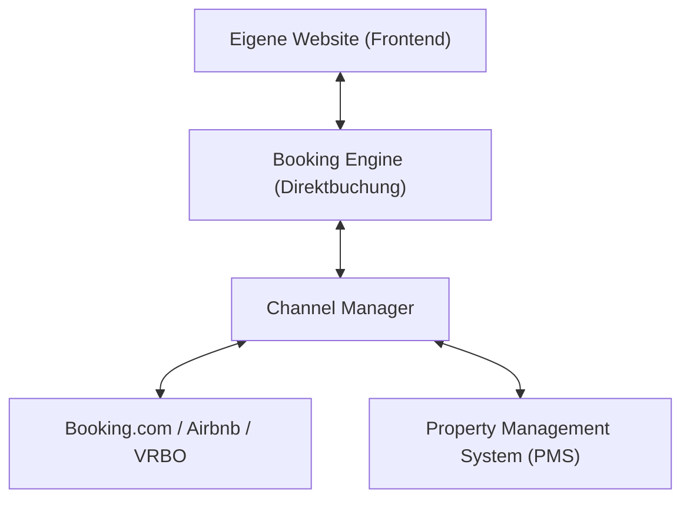

Wer eine eigene Website für ein Hotel oder Ferienobjekt plant, stößt schnell auf Fachbegriffe: PMS, Channel Manager, ICal, Booking Engine, Payment Gateway. Doch welches System braucht man wirklich — und wie verbindet man alles ohne technische Kopfschmerzen?

## Der Tech-Stack im Überblick

### 1. Das Property Management System (PMS)
Das PMS ist das Gehirn Ihres Betriebs. Hier werden Gästedaten, Rechnungen, Meldescheine und der Belegungsplan verwaltet.

### 2. Der Channel Manager
Der Channel Manager ist der Verteiler: Er gleicht Belegungen und Preise in Echtzeit zwischen Ihrem PMS, Ihrer eigenen Website und allen Portalen (Booking.com, Airbnb, FeWo-direkt) ab. Doppelbuchungen sind damit technisch ausgeschlossen.

### 3. Die Booking Engine (Direktbuchungsstrecke)
Die Booking Engine ist das Widget oder Formular auf Ihrer Website, über das Gäste Termine auswählen, Preise einsehen und direkt online bezahlen (z. B. via Stripe, PayPal oder Kreditkarte).

## Worauf es beim Webdesign ankommt

Die beste Software nützt nichts, wenn die Integration auf der Website holprig wirkt. Häufige Fehler sind:
- Buchungskalender, die auf Mobilgeräten unbedienbar sind.
- Unnötige Weiterleitungen auf fremde Domains.
- Langsame Ladezeiten durch unoptimierte Skripte.

Wir binden Ihr bestehendes System nahtlos in den Auftritt ein — ohne Schnittstellenbrüche oder visuelle Stilbrüche.

## Fazit

Sie müssen Ihr funktionierendes Buchungssystem nicht austauschen, um eine moderne Website zu betreiben. Die richtige Architektur verbindet Ihre bestehenden Tools mit einem performanten Frontend.

Planen Sie ein Projekt im Gastgewerbe? Erfahren Sie mehr auf unserer [Hospitality-Seite](/de/hospitality).
