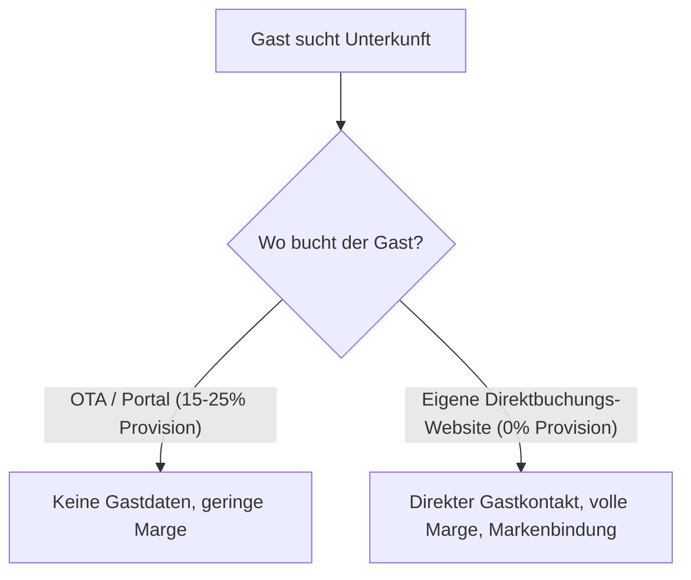

Plattformen wie Booking.com und Airbnb haben die Reisebranche revolutioniert. Sie bringen Reichweite, Sichtbarkeit und Gäste aus aller Welt. Doch diese Reichweite hat ihren Preis: hohe Provisionen pro Buchung, fehlender Zugang zu Gastdaten und die ständige Gefahr, in einem rasterförmigen Preisvergleich austauschbar zu werden.

Immer mehr boutique-Hotels, Ferienwohnungen und Villenbesitzer stellen sich deshalb die Frage: Wie gelingt der Schritt zu mehr **Direktbuchungen**?

## Die Mathematik der Provisionsabhängigkeit

Bei jeder Portalbuchung fließen im Schnitt zwischen 15 % und 25 % des Umsatzes an die Vermittler. Bei einem Jahresumsatz von 100.000 € entspricht das 15.000 € bis 25.000 € — Mittel, die direkt in der Budgetplanung für Renovierung, Personal oder Gäste-Erlebnisse fehlen.

Eine eigene, professionelle Website mit integrierter Direktbuchungsstrecke eliminiert diese Margenfresser für wiederkehrende Gäste und Stammkunden.

## Die 3 Säulen einer erfolgreichen Direktbuchungs-Website

1. **Vertrauen durch visuelle Exzellenz**: Gäste buchen keine Räume, sie buchen ein Gefühl. Hochauflösende Bildsprache, flüssige Animationen und ein klares Screendesign erzeugen mehr Vertrauen als standardisierte Portalraster.
2. **Nahtlose Buchungserfahrung (UX)**: Wenn der Buchungsprozess komplizierter ist als auf Airbnb, springen Gäste ab. Verfügbarkeiten, Preise und Extras müssen transparent und mit wenigen Klicks auswählbar sein.
3. **Echtzeit-Synchronisation via PMS & Channel Manager**: Eine Direktbuchungsstrecke darf nicht zu mehr manuellem Aufwand führen. Verfügbarkeiten müssen automatisch mit allen Portalen synchronisiert werden, um Doppelbuchungen auszuschließen.

## Fazit

Eine eigene Direktbuchungs-Website soll Reiseportale nicht komplett ersetzen, sondern die Abhängigkeit drastisch senken. Jeder Stammgast, der direkt bei Ihnen bucht, stärkt Ihre Marge und Ihre Eigenständigkeit als Marke.

Erfahren Sie mehr über unsere maßgeschneiderten Lösungen auf unserer [Hospitality-Seite](/de/hospitality).
