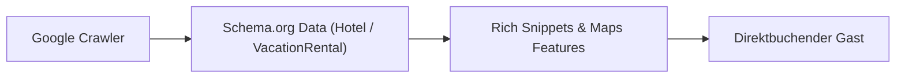

Die meisten Urlauber beginnen ihre Recherche nicht auf Booking.com, sondern bei Google. Suchanfragen wie „Boutique Hotel Ostsee“, „Ferienhaus mit Pool Kreta“ oder „Exklusive Ferienwohnung Berlin“ besitzen eine enorm hohe Kaufabsicht.

Wer hier in den organischen Suchergebnissen oder im Google Local Pack erscheint, gewinnt Gäste ganz ohne Werbeanzeigen oder Portal-Gebühren.

## Die 4 Säulen von Local SEO im Gastgewerbe

### 1. Ein optimiertes Google Unternehmensprofil
Ihr Google Unternehmensprofil (früher Google My Business) ist die digitale Visitenkarte vor Ort. Vollständige Kontaktdaten, aktuelle Bilder, genaue Standortangaben und regelmäßige Gäste-Bewertungen sind Grundvoraussetzung für gute lokalen Rankings.

### 2. Strukturierte Daten (Schema.org)
Damit Google weiß, welche Ausstattung, Preisklassen und Zimmerkategorien Sie anbieten, müssen diese Informationen maschinenlesbar im Quelltext hinterlegt sein (`Hotel`, `Accommodation` oder `VacationRental` Schema).

### 3. Regionale Content-Landingpages
Statt nur allgemeine Ausstattungsmerkmale aufzuzählen, sollten Sie Inhalte bieten, die regionale Suchbedürfnisse abdecken: Anreise-Tipps, Empfehlungen für Restaurants vor Ort, Ausflugsziele und saisonale Highlights.

### 4. Technische Performance & Core Web Vitals
Google priorisiert Websites, die auf Smartphones blitzschnell laden. Langsame Baukasten-Seiten mit unoptimierten Bilddateien fallen im Ranking ab.

## Fazit

Local SEO ist für Gastgeber eine der nachhaltigsten Investitionen überhaupt. Eine schnelle, technisch sauber strukturierte Website bringt kontinuierlich qualifizierte Anfragen aus der organischen Suche.

Erfahren Sie, wie wir Gastgeber bei der digitalen Sichtbarkeit unterstützen: [Hospitality-Leistungen ansehen](/de/hospitality).
