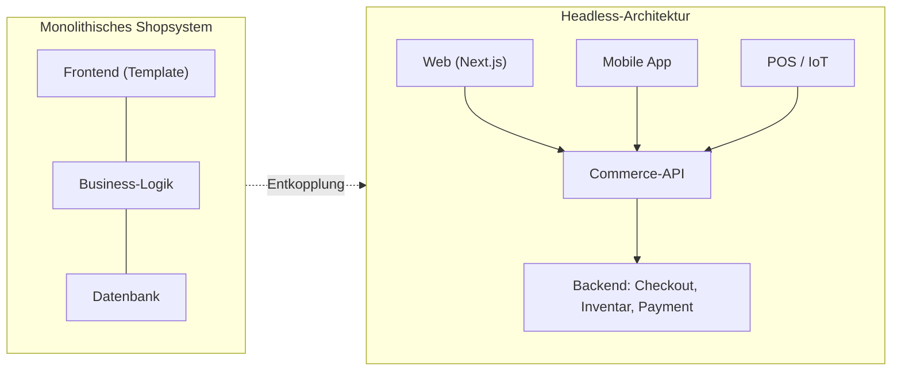

# Headless Commerce: Der Paradigmenwechsel für Marken

Über ein Jahrzehnt lang galt die Gleichung „E-Commerce = Shopsystem". Wer verkaufen wollte, installierte Shopify, Magento oder WooCommerce – und akzeptierte, dass Design, Performance und Nutzererlebnis am Ende von den Grenzen des Templates diktiert wurden. Dieses Modell ist nicht falsch, aber es ist an eine Decke gestoßen. Marken, die sich digital differenzieren wollen, stoßen an genau die Wand, die das monolithische Shopsystem einzieht: Das Frontend ist untrennbar mit dem Backend verheiratet.

Headless Commerce löst diese Ehe auf. Und das ist kein technisches Detail für Entwickler, sondern eine strategische Entscheidung, die direkt auf Ladezeit, Conversion-Rate und Markenwahrnehmung durchschlägt.

## Was „Headless" konkret bedeutet

In einer klassischen (monolithischen) Plattform sind Präsentationsschicht und Geschäftslogik ein einziger Block. Das Backend – also Warenkorb, Checkout, Inventar, Zahlungsabwicklung – rendert gleichzeitig die HTML-Seite, die der Nutzer sieht. Ändern Sie das Aussehen, riskieren Sie die Logik. Wollen Sie die Logik auf einem neuen Kanal ausspielen, müssen Sie das Frontend duplizieren.

Headless trennt diese beiden Welten sauber. Das Backend wird zu einem reinen Datenlieferanten, der seine Funktionen über eine API bereitstellt. Das Frontend ist eine eigenständige Anwendung, die diese API konsumiert und frei entscheidet, wie das Ergebnis aussieht.

Der entscheidende Unterschied: Im Monolithen gibt es genau ein Frontend, fest verdrahtet. In der Headless-Welt hängen beliebig viele Frontends am selben Backend – Web, App, Kassensystem, Sprachassistent – und jedes kann sich unabhängig weiterentwickeln.

## Warum das für Ihre Marke zählt

### 1. Performance wird zur Standardeinstellung

Monolithische Systeme müssen bei jedem Seitenaufruf serverseitig ein Template mit Datenbankabfragen zusammensetzen. Ein Headless-Frontend auf Basis von Next.js kann Produktseiten hingegen statisch vorrendern (SSG) oder am Edge ausliefern – der Nutzer erhält fertiges HTML in Millisekunden, während der dynamische Teil (Preis, Warenkorb) im Hintergrund nachgeladen wird. Ladezeit ist kein Nachgedanke mehr, sondern Teil der Architektur.

  <svg viewBox="0 0 640 220" width="100%" role="img" aria-label="Vergleich der durchschnittlichen Ladezeit: Monolith 3,2 Sekunden gegenüber Headless 0,9 Sekunden">
    <text x="0" y="24" fill="var(--color-text-secondary)" fontFamily="sans-serif" fontSize="14">Durchschnittliche Ladezeit einer Produktseite (LCP)</text>

    <text x="0" y="86" fill="var(--color-text)" fontFamily="sans-serif" fontSize="15">Monolith</text>
    <rect x="120" y="70" width="470" height="22" rx="6" fill="var(--color-border)"/>
    <rect x="120" y="70" width="470" height="22" rx="6" fill="var(--color-chart-2)"/>
    <text x="600" y="86" fill="var(--color-text)" fontFamily="sans-serif" fontSize="15" textAnchor="end" dx="-6">3,2 s</text>

    <text x="0" y="146" fill="var(--color-text)" fontFamily="sans-serif" fontSize="15">Headless</text>
    <rect x="120" y="130" width="470" height="22" rx="6" fill="var(--color-border)"/>
    <rect x="120" y="130" width="132" height="22" rx="6" fill="var(--color-chart-1)"/>
    <text x="262" y="146" fill="var(--color-text)" fontFamily="sans-serif" fontSize="15" dx="8">0,9 s</text>

    <text x="0" y="196" fill="var(--color-text-muted)" fontFamily="sans-serif" fontSize="12">Illustrativer Vergleich. Reale Werte hängen von Implementierung, Hosting und Datenvolumen ab.</text>
  </svg>

Der Zusammenhang mit dem Geschäftsergebnis ist gut dokumentiert: Google-Untersuchungen zeigen, dass die Wahrscheinlichkeit eines Absprungs bereits deutlich steigt, wenn die Ladezeit von einer auf drei Sekunden wächst. Jede eingesparte Zehntelsekunde ist damit kein kosmetischer Gewinn, sondern bares Geld.

### 2. Omnichannel ohne doppelten Aufwand

Weil das Backend nur noch Daten liefert, kann derselbe Produktkatalog, derselbe Warenkorb und derselbe Checkout auf beliebig vielen Kanälen erscheinen: Website, native App, In-Store-Display, Marktplatz-Integration oder ein Interface, das es heute noch gar nicht gibt. Sie pflegen ein Backend – und bespielen jeden Touchpoint.

### 3. Gestalterische Freiheit ohne technische Kompromisse

Die vielleicht wichtigste Konsequenz für eine markengetriebene Agentur wie uns: Das Frontend ist nicht länger Geisel eines Themes. Micro-Interactions, individuelle Produktkonfiguratoren, ungewöhnliche Layouts, aufwendige Storytelling-Seiten – all das lässt sich umsetzen, ohne gegen das Shopsystem zu kämpfen. Das digitale Einkaufserlebnis kann so eigenständig sein wie Ihre Markenidentität.

## Der ehrliche Blick: Wann Headless *nicht* die richtige Wahl ist

Thought Leadership heißt auch, die Grenzen zu benennen. Headless ist kein Selbstzweck. Für einen kleinen Shop mit Standardsortiment, engem Budget und ohne Differenzierungsanspruch ist ein gut konfigurierter Monolith oft die klügere, günstigere Entscheidung. Headless entfaltet seinen ROI dort, wo Individualität, Performance, mehrere Kanäle oder hohe Skalierung eine Rolle spielen. Wer diese Anforderungen nicht hat, zahlt sonst für Komplexität, die er nicht nutzt.

## Wie ein Umstieg in der Praxis abläuft

Ein Wechsel muss kein riskanter Big-Bang sein. Bewährt hat sich ein schrittweises Vorgehen:

- **Audit & API-Bewertung:** Prüfen, ob das bestehende Backend eine belastbare API bietet oder ob eine Commerce-API-Schicht (etwa ein API-first-Anbieter) davorgesetzt wird.
- **Frontend-Neubau:** Aufbau der Präsentationsschicht in einem modernen Framework, zunächst für die wichtigsten Templates (Startseite, Kategorie, Produktdetail).
- **Inkrementeller Rollout:** Kanäle oder Seitenbereiche nacheinander umstellen, statt alles gleichzeitig – so bleibt das Risiko kontrollierbar.
- **Messung:** Core Web Vitals, Conversion-Rate und Wartungsaufwand vorher/nachher vergleichen, um den ROI zu belegen.

## Fazit

Headless Commerce ist kein Trend, sondern die logische Konsequenz aus einer einfachen Erkenntnis: Ihre Marke sollte das Erlebnis bestimmen, nicht die Grenzen eines Shopsystems. Die Entkopplung von Frontend und Backend verwandelt Performance in eine Standardeigenschaft, macht echten Omnichannel wirtschaftlich und gibt Ihnen die gestalterische Freiheit zurück, die ein monolithisches Template Ihnen nimmt.

Bei Goldvale Studios bauen wir maßgeschneiderte Headless-Architekturen, die mit Ihrem Unternehmen mitwachsen – von der API-Strategie bis zum letzten Pixel des Frontends.

## Häufige Fragen

**Ist Headless Commerce nur etwas für große Unternehmen?**
Nein, aber es lohnt sich vor allem dann, wenn Performance, individuelles Design, mehrere Verkaufskanäle oder Skalierung wichtig sind. Für sehr kleine Standard-Shops kann ein klassisches System wirtschaftlicher sein.

**Verliere ich beim Umstieg meine SEO-Rankings?**
Nicht, wenn der Umzug sauber geplant ist. Durch serverseitiges Rendering, korrekte Weiterleitungen und strukturierte Daten profitiert SEO in der Regel sogar – schnellere Ladezeiten wirken sich positiv auf die Core Web Vitals aus.

**Brauche ich für Headless zwingend Next.js?**
Nein. Next.js ist eine sehr verbreitete Wahl, aber jedes moderne Frontend-Framework, das eine API konsumieren kann, ist grundsätzlich geeignet. Entscheidend ist die Trennung von Frontend und Backend, nicht das konkrete Werkzeug.