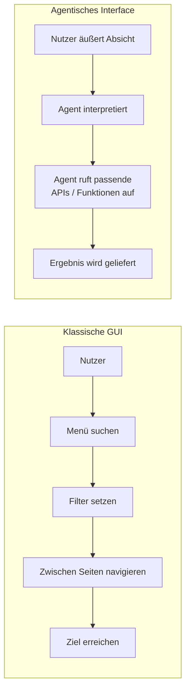

# Der KI-Shift in der Webarchitektur navigieren

Künstliche Intelligenz verändert das Web schneller als jede Technologie seit dem Smartphone. Doch die entscheidende Verschiebung ist nicht, dass irgendwo eine Chat-Box eingebaut wird. Es geht um etwas Grundlegenderes: Das Web wird nicht mehr nur von Menschen gelesen, sondern zunehmend von Maschinen – von autonomen Agenten, Such-Assistenten und Large Language Models, die Inhalte interpretieren, zusammenfassen und weiterverarbeiten.

Wer seine digitale Infrastruktur nicht auf diese neue Leserschaft vorbereitet, riskiert, für sie unsichtbar zu werden.

## Vom Klick zur Absicht

Klassische grafische Oberflächen zwingen den Nutzer, seinen Weg durch Menüs, Filter und Buttons zu suchen. Die Interaktion ist an vorgegebene Pfade gebunden. Konversationelle und agentische Interfaces drehen das um: Der Nutzer äußert eine Absicht, und das System findet den Weg.

Der Unterschied ist nicht nur Komfort. Ein agentisches Interface setzt eine Architektur voraus, in der jede Funktion sauber über eine API ansprechbar ist – nicht in einem Template vergraben. Bei Goldvale Studios integrieren wir KI deshalb nicht als aufgesetztes Gimmick, sondern als Kernkomponente der User Experience, die von der Architektur her mitgedacht wird.

## Strukturierte Daten sind wichtiger denn je

LLMs und Such-Agenten „sehen" eine Website anders als ein Mensch. Sie interessieren sich nicht für ein hübsches Layout, sondern für Bedeutung. Fehlt einer Seite eine saubere semantische Struktur, aussagekräftige Überschriften-Hierarchie, strukturierte Daten (JSON-LD) und eine klare Informationsarchitektur, dann bleibt ihr Inhalt für Maschinen bestenfalls Rauschen.

Das hat direkte Konsequenzen für die Sichtbarkeit. Wer im Jahr 2026 gefunden werden will, optimiert nicht mehr nur für die klassische Google-Suche, sondern für ein ganzes Ökosystem maschineller Leser. Die wichtigsten Bausteine dafür:

- **Semantisches HTML:** Bedeutung durch die richtigen Elemente statt durch generische Container.
- **Strukturierte Daten (JSON-LD):** Explizite Auszeichnung von Produkten, Artikeln, FAQs und Organisationen, damit Maschinen den Kontext verstehen.
- **Klare Informationsarchitektur:** Eine logische, hierarchische Struktur, die sich maschinell erschließen lässt.
- **Saubere, zugängliche APIs:** Damit Agenten nicht nur lesen, sondern auch handeln können.

## Der ehrliche Blick: KI ist ein Werkzeug, kein Zweck

Es ist verlockend, KI überall hineinzubauen, weil sie neu ist. Genau das ist die Falle. Eine Chat-Oberfläche dort, wo ein einfacher Button schneller ans Ziel führt, ist kein Fortschritt, sondern Reibung. Der Maßstab bleibt immer der Nutzen für den Menschen: KI soll eine Aufgabe leichter machen – nicht beweisen, dass man auf der Höhe der Zeit ist. Wer diesen Maßstab verliert, baut beeindruckende Demos und enttäuschende Produkte.

## Fazit

Der KI-Shift ist weniger eine Frage neuer Features als eine Frage der Grundstruktur. Interfaces bewegen sich vom vorgegebenen Klickpfad zur geäußerten Absicht, und die Leserschaft des Webs erweitert sich vom Menschen um die Maschine. Beide Entwicklungen belohnen dieselbe Grundlage: eine saubere, semantische, API-fähige Architektur. Die Zukunft gehört den Marken, deren digitale Infrastruktur bereit ist, sowohl von Menschen verstanden als auch von Maschinen erschlossen zu werden.

## Häufige Fragen

**Was bedeutet „für LLMs optimieren" konkret?**
Es bedeutet, Inhalte so zu strukturieren, dass Maschinen ihre Bedeutung zuverlässig erfassen: semantisches HTML, strukturierte Daten via JSON-LD, klare Überschriften-Hierarchien und eine logische Informationsarchitektur.

**Ersetzt KI-Optimierung die klassische SEO?**
Nein, sie erweitert sie. Viele Grundlagen guter SEO – saubere Struktur, schnelle Ladezeiten, klare Inhalte – sind zugleich die Grundlage für gute Sichtbarkeit bei KI-gestützten Such-Assistenten.

**Braucht jede Website ein konversationelles Interface?**
Nein. Konversationelle Interfaces lohnen sich dort, wo Nutzer komplexe oder offene Absichten haben. Für viele Aufgaben bleibt eine klassische, gut gestaltete Oberfläche die schnellere und klarere Lösung.