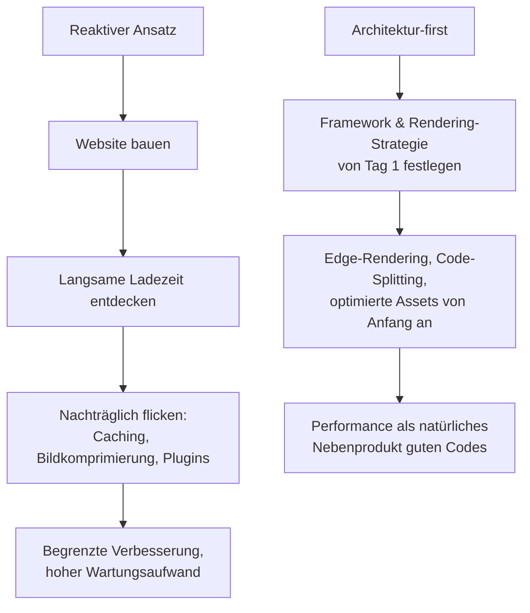

# Warum Performance keine Option ist — sondern Teil der Marke

Es gibt einen Moment, der über den Erfolg jeder digitalen Marke entscheidet, und er dauert weniger als eine Sekunde: der erste Seitenaufruf. In dieser Zeitspanne bildet sich der Nutzer ein Urteil – nicht bewusst, sondern instinktiv. Fühlt sich die Seite schnell und flüssig an, überträgt sich dieser Eindruck auf das gesamte Unternehmen. Stockt sie, wirkt selbst die beste Marke veraltet und unzuverlässig.

Performance ist deshalb keine technische Kennzahl, die man am Ende eines Projekts noch schnell verbessert. Sie ist Teil der Markenwahrnehmung – so real wie Ihr Logo, Ihre Typografie und Ihr Tonfall.

## Der erste Eindruck entsteht in Millisekunden

Nutzer setzen Geschwindigkeit unbewusst mit Kompetenz gleich. Diese Assoziation ist psychologisch tief verankert: Was schnell reagiert, wirkt lebendig, gepflegt und vertrauenswürdig. Was zögert, weckt Zweifel. Genau deshalb ist Ladezeit kein reines Entwicklerthema, sondern eine Frage der Markenführung.

Der wirtschaftliche Effekt ist messbar. Mit jeder zusätzlichen Sekunde Ladezeit sinkt die Wahrscheinlichkeit, dass ein Besucher bleibt und konvertiert – der Zusammenhang ist über zahlreiche Branchen hinweg belegt.

  <svg
    viewBox="0 0 640 260"
    width="100%"
    role="img"
    aria-label="Relative Conversion-Rate in Abhängigkeit von der Ladezeit: fällt mit steigender Ladezeit deutlich ab"
  >
    <text x="0" y="24" fill="#9a9aa2" fontFamily="sans-serif" fontSize="14">
      Relative Conversion-Rate nach Ladezeit
    </text>

    <line x1="60" y1="40" x2="60" y2="210" stroke="#3a3a40" strokeWidth="1" />
    <line x1="60" y1="210" x2="620" y2="210" stroke="#3a3a40" strokeWidth="1" />

    <polyline
      points="60,60 200,78 340,120 480,168 600,196"
      fill="none"
      stroke="#c9a54e"
      strokeWidth="3"
    />

    <circle cx="60" cy="60" r="5" fill="#c9a54e" />
    <circle cx="200" cy="78" r="5" fill="#c9a54e" />
    <circle cx="340" cy="120" r="5" fill="#c9a54e" />
    <circle cx="480" cy="168" r="5" fill="#c9a54e" />
    <circle cx="600" cy="196" r="5" fill="#c9a54e" />

    <text x="60" y="230" fill="#9a9aa2" fontFamily="sans-serif" fontSize="12" textAnchor="middle">1 s</text>
    <text x="200" y="230" fill="#9a9aa2" fontFamily="sans-serif" fontSize="12" textAnchor="middle">2 s</text>
    <text x="340" y="230" fill="#9a9aa2" fontFamily="sans-serif" fontSize="12" textAnchor="middle">3 s</text>
    <text x="480" y="230" fill="#9a9aa2" fontFamily="sans-serif" fontSize="12" textAnchor="middle">4 s</text>
    <text x="600" y="230" fill="#9a9aa2" fontFamily="sans-serif" fontSize="12" textAnchor="middle">5 s</text>

    <text x="0" y="252" fill="#6f6f76" fontFamily="sans-serif" fontSize="12">
      Illustrativer Trend. Der genaue Abfall variiert je nach Branche und Gerät.
    </text>
  </svg>

## Core Web Vitals: Performance wird messbar und rankt

Was früher Bauchgefühl war, ist heute eine harte Kennzahl. Mit den Core Web Vitals hat Google messbare Schwellenwerte etabliert, die direkt in das Suchmaschinen-Ranking einfließen. Drei Metriken stehen im Zentrum:

- **LCP (Largest Contentful Paint):** Wie schnell wird der größte sichtbare Inhalt geladen? Gut ist ein Wert unter 2,5 Sekunden.
- **INP (Interaction to Next Paint):** Wie schnell reagiert die Seite auf Eingaben? Gut ist unter 200 Millisekunden.
- **CLS (Cumulative Layout Shift):** Wie stabil bleibt das Layout beim Laden? Gut ist ein Wert unter 0,1.

Diese Werte sind keine Empfehlung, sondern ein Rankingfaktor. Wer sie ignoriert, verschenkt Sichtbarkeit – und damit den günstigsten Kanal überhaupt: organischen Traffic.

## Architektur vor Optimierung

Der häufigste Fehler in der Branche ist die Reihenfolge. Viele Agenturen bauen zuerst eine Website und versuchen anschließend, sie mit Caching-Tricks, nachträglicher Bildkomprimierung und Plugins schneller zu machen. Das ist, als würde man ein Haus ohne Fundament bauen und später Stützpfeiler einziehen. Es hilft ein wenig – aber das Grundproblem bleibt.

Der bessere Weg dreht die Reihenfolge um: Performance beginnt bei der Architektur.

Bei Goldvale Studios setzen wir von Tag 1 auf moderne Frameworks wie Next.js mit Turbopack und Edge-Rendering. Assets werden von Beginn an optimiert, JavaScript nur dort geladen, wo es gebraucht wird, und Inhalte so nah wie möglich am Nutzer ausgeliefert. Wenn das Fundament stimmt, ist Geschwindigkeit kein Kraftakt, sondern die Standardeinstellung.

## Der ehrliche Blick: Performance ist kein Selbstzweck

Ein schneller, leerer Auftritt gewinnt niemanden. Geschwindigkeit ersetzt weder gute Inhalte noch ein durchdachtes Nutzererlebnis – sie verstärkt sie. Der größte Fehler wäre, Millisekunden zu jagen und dabei die eigentliche Aufgabe zu vergessen: dem Nutzer schnell *und* überzeugend das zu geben, wofür er gekommen ist. Performance ist die Bühne, nicht das Stück.

## Fazit

Ladezeit ist kein technisches Nachgedanke, sondern ein Markensignal. Sie entscheidet über den ersten Eindruck, über die Conversion-Rate und über die Sichtbarkeit in der Suche. Wer Performance als festen Bestandteil der Architektur begreift – und nicht als nachträgliche Reparatur – baut Plattformen, die schneller sind, besser ranken und schlicht professioneller wirken.

Bei Goldvale Studios ist Web-Performance kein „nice-to-have", sondern das Fundament, auf dem alles andere steht.

## Häufige Fragen

**Was sind gute Core-Web-Vitals-Werte?**
Als gut gelten ein LCP unter 2,5 Sekunden, ein INP unter 200 Millisekunden und ein CLS unter 0,1. Diese Schwellenwerte fließen in das Google-Ranking ein.

**Kann man eine bestehende langsame Website nachträglich schnell machen?**
Teilweise. Caching und Bildoptimierung helfen, stoßen aber an Grenzen, wenn die Grundarchitektur nicht auf Performance ausgelegt ist. Oft ist ein Neuaufbau des Frontends wirtschaftlicher als dauerhaftes Nachflicken.

**Wirkt sich Performance wirklich auf den Umsatz aus?**
Ja. Schnellere Ladezeiten senken die Absprungrate und erhöhen die Conversion-Rate messbar – der Effekt ist über viele Branchen hinweg belegt.