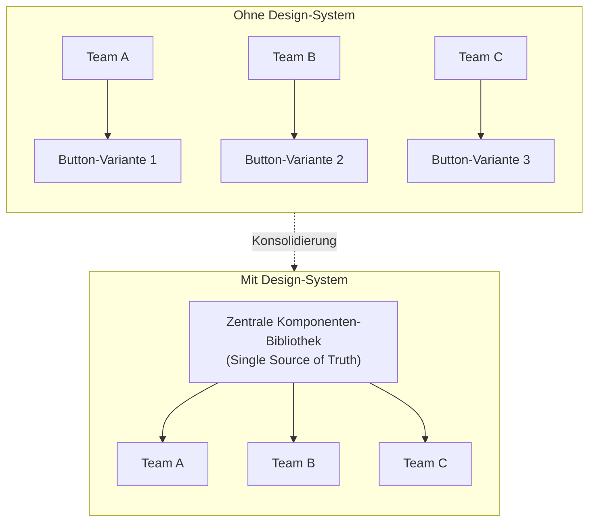

# Konsistenz skalieren: Der wahre ROI von Design-Systemen

Wenn Unternehmen wachsen, wächst selten ihre digitale Kohärenz mit. Ein Team baut die neue Landingpage, ein anderes die interne Web-App, ein drittes das Kundenportal. Jedes trifft seine eigenen Entscheidungen. Das Ergebnis: Buttons sehen an drei Stellen unterschiedlich aus, Abstände variieren, die Typografie driftet auseinander – und die Nutzererfahrung fühlt sich nicht mehr an wie eine Marke, sondern wie drei.

Diese Fragmentierung ist kein kosmetisches Problem. Sie kostet Zeit, Geld und Vertrauen. Ein Design-System ist die Antwort darauf – und sein ROI lässt sich beziffern.

## Fragmentierung: das unsichtbare Leck

Ohne zentrale Quelle entsteht Wildwuchs. Jede Abteilung entwickelt ihre eigene Variante derselben Komponente, und mit jeder Variante wächst der Wartungsaufwand, während die Markenwahrnehmung erodiert.

Im linken Zustand multipliziert jedes Team die Komplexität. Im rechten teilen sich alle dieselbe Grundlage – eine Änderung an zentraler Stelle wirkt überall.

## Das Design-System als Single Source of Truth

Ein Design-System ist weit mehr als ein UI-Kit in Figma. Es ist eine kodierte Bibliothek echter, produktiver Komponenten – etwa in React und Tailwind – die von Designern und Entwicklern gleichermaßen genutzt wird. Der entscheidende Punkt: Design und Code sind dieselbe Wahrheit, nicht zwei getrennte Welten, die man mühsam synchron hält.

Wenn wir bei Goldvale Studios ein Design-System implementieren, sorgen wir dafür, dass eine Änderung an der Markenfarbe an genau einer Stelle definiert wird – und sich automatisch über alle digitalen Produkte hinweg fortpflanzt. Kein manuelles Nachziehen, kein Vergessen einzelner Seiten.

## Der ROI ist messbar

Der Nutzen eines Design-Systems bleibt nicht im Vagen. Er zeigt sich in konkreten Kennzahlen:

- **Schnellere Time-to-Market:** Neue Features werden nicht mehr „from scratch" gestaltet, sondern aus geprüften Komponenten zusammengesetzt. Was früher Tage dauerte, wird zur Sache von Stunden.
- **Weniger Bugs:** Zentrale, gut getestete Komponenten reduzieren die Fehleranfälligkeit drastisch – ein einmal gelöstes Problem bleibt gelöst.
- **Geringere Wartungskosten:** Aktualisierungen erfolgen an einer Stelle statt an dutzenden.
- **Nahtlose Markenwahrnehmung:** Der Nutzer spürt, dass er sich durchgängig im selben Ökosystem bewegt – das schafft Vertrauen.

## Der ehrliche Blick: Ein Design-System ist eine Investition, kein Selbstläufer

Ein Design-System zahlt sich nicht ab dem ersten Tag aus. Der Aufbau kostet Zeit, und bei einem sehr kleinen Team mit einem einzigen Produkt kann der Overhead den Nutzen zunächst übersteigen. Ebenso gefährlich ist ein System, das gebaut, aber nicht gepflegt wird – es veraltet und wird schnell umgangen. Der ROI entsteht durch Skalierung und durch Disziplin in der Pflege, nicht durch die bloße Existenz einer Komponenten-Bibliothek.

## Fazit

Konsistenz über viele Produkte und Teams hinweg ist kein Zufall, sondern das Ergebnis einer systematischen Architektur. Ein Design-System verwandelt verstreute Einzelentscheidungen in eine gemeinsame Grundlage, beschleunigt die Entwicklung, senkt Fehler und Kosten und hält die Marke über alle Touchpoints hinweg zusammen. Für wachsende Unternehmen ist es damit weniger ein Design-Thema als eine strategische Infrastruktur-Entscheidung.

## Häufige Fragen

**Ab welcher Größe lohnt sich ein Design-System?**
Sobald mehrere Produkte oder mehrere Teams parallel an der digitalen Präsenz arbeiten. Bei einem einzigen kleinen Produkt kann der Aufwand den Nutzen anfangs übersteigen.

**Ist ein Design-System dasselbe wie eine Komponenten-Bibliothek in Figma?**
Nein. Die Figma-Bibliothek ist der Design-Teil. Ein vollständiges Design-System umfasst auch die kodierten, produktiven Komponenten sowie Richtlinien, sodass Design und Code dieselbe Quelle teilen.

**Wie hält man ein Design-System langfristig aktuell?**
Durch klare Verantwortlichkeit (Ownership), Versionierung und einen definierten Prozess, wie neue Komponenten aufgenommen und bestehende geändert werden. Ohne Pflege veraltet jedes System.