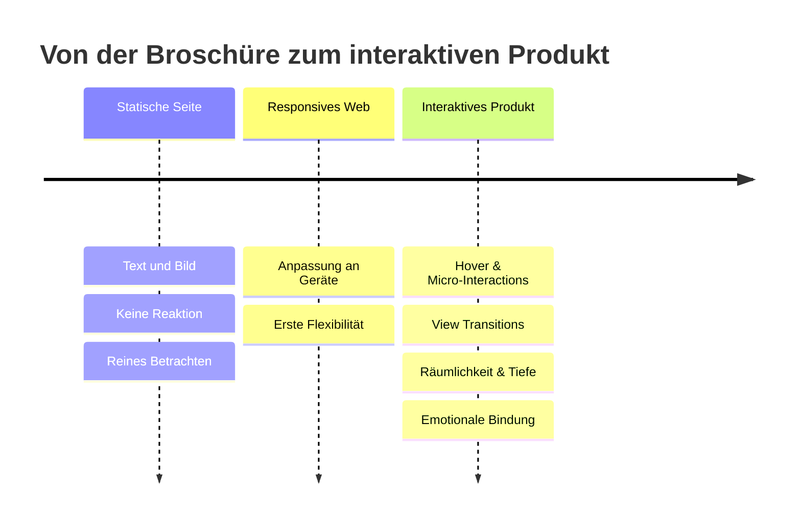

# Das Ende der statischen Seite: Web-Erlebnisse, die atmen

Erinnern Sie sich an die Websites von früher? Text- und Bildwüsten, die im Grunde nichts anderes waren als digitalisierte Broschüren – ein Flyer, den man ins Internet gehoben hatte. Sie informierten, aber sie reagierten nicht. Sie waren da, aber sie lebten nicht.

Diese Zeiten sind vorbei. Nutzer erwarten heute keine Dokumente mehr, sondern Erlebnisse. Eine Website ist nicht länger eine Seite, die man betrachtet, sondern ein Produkt, mit dem man interagiert.

## Vom Layout zur Interaktion

Der Unterschied zwischen einer statischen Seite und einem lebendigen Produkt liegt in der Reaktion. Ein exzellentes digitales Produkt antwortet auf den Nutzer: Ein subtiler Hover-Effekt bestätigt, dass ein Element anklickbar ist. Ein nahtloser Übergang beim Seitenwechsel (View Transitions) erhält den Kontext. Eine Micro-Interaction gibt Feedback, dass eine Aktion angekommen ist.

Wichtig ist die Betonung auf *subtil*. Es geht nicht um überladene Animationen, die vom Inhalt ablenken, sondern um Feedback, das Orientierung gibt. Gute Interaktion bemerkt man nicht bewusst – man vermisst sie erst, wenn sie fehlt.

## Räumlichkeit und Tiefe

Das Web ist längst kein flaches Blatt Papier mehr. Mit modernen CSS-Eigenschaften wie `backdrop-filter` (Glassmorphismus) und weichen, organischen Schatten lässt sich Tiefe erzeugen, die Hierarchie und Fokus vermittelt. Ebenen legen sich über- und hintereinander, und der Nutzer erfasst intuitiv, was vorn und was hinten liegt.

Ein weiteres Werkzeug ist das gezielte Scroll-Telling: Inhalte enthüllen sich im Takt der Scrollbewegung und erzählen so eine Geschichte, ohne den Nutzer auf einmal zu überfordern. Bewegung wird hier zur Dramaturgie – nicht zum Selbstzweck.

## Der ehrliche Blick: Bewegung braucht Zurückhaltung

Hier liegt zugleich die größte Gefahr. Sobald Animation zum Selbstzweck wird, kippt das Erlebnis ins Gegenteil: Ladezeiten steigen, die Bedienung wird zäh, und Nutzer mit Bewegungsempfindlichkeit werden ausgeschlossen. Deshalb gehört zu jeder Animation die Frage nach ihrem Zweck – und die technische Rücksicht, etwa das Respektieren von `prefers-reduced-motion`. Ein Erlebnis, das atmet, ist nicht eines, das ständig zappelt. Zurückhaltung ist hier ein Qualitätsmerkmal, kein Mangel an Ambition.

## Fazit

Die statische Seite hat ausgedient, weil sie nicht mehr das liefert, was Nutzer erwarten: eine Beziehung. Bewegung, Tiefe und feines Feedback verwandeln ein passives Dokument in ein Produkt, das reagiert – und das schafft emotionale Bindung. Entscheidend ist dabei die Haltung: nicht mehr Animation um jeden Preis, sondern gezielte Interaktion, die dem Inhalt dient. Wer seine Website heute noch wie einen Flyer gestaltet, verschenkt genau diese Bindung.

## Häufige Fragen

**Verlangsamen Animationen nicht die Website?**
Schlecht umgesetzte, ja. Gut umgesetzte Interaktionen nutzen GPU-beschleunigte CSS-Eigenschaften und sind kaum spürbar. Entscheidend ist ein sparsamer, gezielter Einsatz statt Effekthascherei.

**Was ist mit Nutzern, die Bewegung als störend empfinden?**
Moderne Umsetzungen berücksichtigen die Systemeinstellung `prefers-reduced-motion` und reduzieren oder deaktivieren Animationen automatisch. Barrierefreiheit ist hier kein Zusatz, sondern Pflicht.

**Braucht wirklich jede Website aufwendige Interaktion?**
Nein. Das richtige Maß hängt von Zielgruppe und Zweck ab. Eine Behörden- oder Dokumentationsseite lebt von Klarheit, ein Markenauftritt eher von Erlebnis. Interaktion soll dem Ziel dienen, nicht es überdecken.