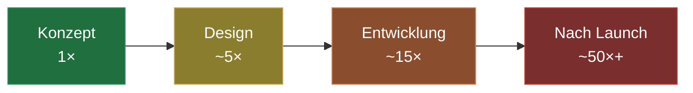

# Der unsichtbare Wert von UX-Research

Viele Projekte beginnen mit einer grandiosen Vision. Wochenlang wird designt, monatelang programmiert – und beim Launch passiert erschreckend wenig. Die Nutzer verstehen das Produkt nicht, finden die entscheidende Funktion nicht oder springen im Checkout ab. Die Ursache liegt selten in der Umsetzung. Sie liegt am Anfang: Die Entscheidungen basierten auf Annahmen statt auf Wissen.

UX-Research schließt genau diese Lücke. Es ist die Disziplin, das Raten durch Beobachten zu ersetzen – und damit die teuerste Zeile Code zu verhindern: die, die für ein Feature geschrieben wird, das niemand braucht.

## Warum Research zuerst gestrichen wird – und warum das ein Trugschluss ist

UX-Research ist häufig der erste Posten, der aus dem Budget fällt. Der Grund: Es liefert scheinbar „keinen greifbaren Output". Man sieht kein Interface, kein fertiges Feature, nichts zum Vorzeigen. Diese Wahrnehmung ist verständlich – und teuer.

Denn der Wert von Research ist nicht das, was dadurch entsteht, sondern das, was dadurch *nicht* entsteht: der falsche Feature, der überflüssige Entwicklungssprint, die Support-Welle nach dem Launch. Diese Kosten tauchen in keinem Projektplan auf, weil sie unsichtbar bleiben, wenn Research sie verhindert.

## Die Ökonomie des frühen Fehlers

Ein Denkfehler in der Konzeptphase kostet fast nichts, wenn man ihn dort korrigiert. Derselbe Fehler kostet ein Vielfaches, wenn er erst nach dem Launch auffällt – dann steckt er in Design, Code, Datenbank und Dokumentation. Diese Kostenkurve ist eine der belastbarsten Erkenntnisse der Produktentwicklung.

Die Zahlen sind illustrativ, aber die Größenordnung ist real: Je später ein Fehler entdeckt wird, desto teurer wird seine Behebung. UX-Research verschiebt das Entdecken nach ganz vorne – dorthin, wo Korrekturen fast gratis sind.

## Prototyping vor Programmierung

Bei Goldvale Studios setzen wir auf schnelles Prototyping und echtes Nutzerfeedback, bevor wir auch nur eine Zeile produktiven Code schreiben. Ein klickbarer Prototyp lässt sich in Tagen bauen und in Stunden testen – ein fertiges Feature kostet Wochen. Zu den Methoden, die sich bewährt haben, zählen:

- **Usability-Tests:** Echte Nutzer versuchen, eine typische Aufgabe zu lösen. Wo sie stocken, liegt ein Problem – kein Meinungsstreit, sondern eine Beobachtung.
- **User-Interviews:** Sie decken Motivationen und mentale Modelle auf, die aus Analytics-Daten allein nie sichtbar würden.
- **Heatmaps & Session-Analysen:** Sie zeigen, wo Nutzer tatsächlich klicken und scrollen – oft überraschend anders als geplant.
- **A/B-Tests:** Sie ersetzen Diskussionen über Geschmack durch belastbare Daten.

## Der ehrliche Blick: Research ersetzt keine Entscheidung

UX-Research liefert Erkenntnisse, keine fertigen Antworten. Wer erwartet, dass Tests jede Designfrage automatisch beantworten, wird enttäuscht. Die Kunst liegt in der Interpretation – und in der Bereitschaft, unbequeme Ergebnisse zu akzeptieren. Research, dessen Ergebnisse man nur bestätigt sehen will, ist verschwendetes Budget. Der Wert entsteht erst, wenn man bereit ist, sich vom Ergebnis überraschen zu lassen.

## Fazit

UX-Research fühlt sich an wie ein Kostenpunkt und ist in Wahrheit eine Versicherung gegen die teuersten Fehler der Produktentwicklung. Es verwandelt Annahmen in Wissen, verlagert Korrekturen in die günstige Frühphase und sorgt dafür, dass am Ende ein Produkt steht, das echte Probleme löst. Das Resultat: höhere Akzeptanz, weniger Support-Anfragen und Nutzer, die verstehen, wofür sie gekommen sind.

## Häufige Fragen

**Wie viele Nutzer braucht man für einen aussagekräftigen Usability-Test?**
Für qualitative Tests decken oft schon fünf Nutzer die Mehrheit der gravierenden Usability-Probleme auf. Für quantitative Aussagen (etwa A/B-Tests) braucht es deutlich größere Stichproben.

**Lohnt sich UX-Research auch für kleine Projekte?**
Ja. Gerade bei knappem Budget ist es besonders schmerzhaft, Ressourcen in das falsche Feature zu investieren. Schon leichtgewichtige Methoden wie kurze Prototyp-Tests bringen hier großen Nutzen.

**Ist UX-Research dasselbe wie Marktforschung?**
Nein. Marktforschung fragt, *ob* ein Bedarf existiert. UX-Research untersucht, *wie* Menschen ein konkretes Produkt tatsächlich nutzen und wo sie dabei scheitern.