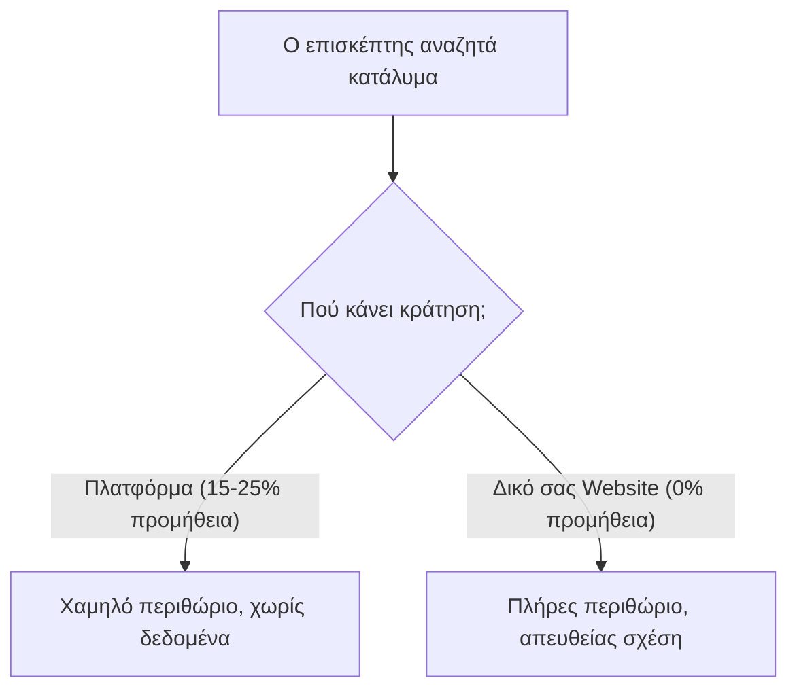

Οι πλατφόρμες όπως το Booking.com και το Airbnb προσφέρουν προβολή και επισκέπτες. Ωστόσο, αυτή η προβολή συνοδεύεται από υψηλές προμήθειες (15% έως 25%) σε κάθε κράτηση.

Ένα δικό σας σύστημα απευθείας κρατήσεων εξαλείφει αυτές τις προμήθειες για τους επαναλαμβανόμενους επισκέπτες σας.

## Οι 3 πυλώνες επιτυχίας

1. **Εμπιστοσύνη μέσω Αισθητικής**: Επαγγελματική φωτογραφία και καθαρός σχεδιασμός.
2. **Εύκολη Διαδικασία Κράτησης**: Διαφάνεια στις τιμές και ελάχιστα βήματα.
3. **Αυτόματος Συγχρονισμός**: Σύνδεση με Channel Manager για αποφυγή διπλοκρατήσεων.

Μάθετε περισσότερα στη σελίδα μας για το [Hospitality](/el/hospitality).
