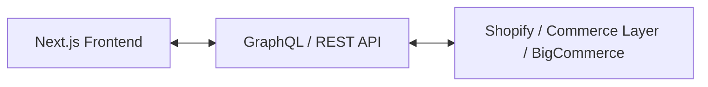

Το παραδοσιακό ηλεκτρονικό εμπόριο συχνά περιορίζεται από μονολιθικές πλατφόρμες. Στο **Headless Commerce**, το frontend (η εμφάνιση που βλέπει ο χρήστης) διαχωρίζεται πλήρως από το backend (διαχείριση προϊόντων, παραγγελιών και πληρωμών) μέσω APIs.

## Τα πλεονεκτήματα του Headless Commerce

1. **Αστραπιαία Ταχύτητα**: Με τεχνολογίες όπως το Next.js, οι σελίδες προϊόντων προ-παράγονται στα Edge servers.
2. **Απόλυτη Σχεδιαστική Ελευθερία**: Χωρίς τους περιορισμούς των έτοιμων themes του Shopify ή WooCommerce.
3. **Omnichannel Δυνατότητες**: Το ίδιο backend μπορεί να τροφοδοτήσει eshops, mobile apps, ακόμη και smart devices.

## Συμπέρασμα

Το Headless Commerce είναι η ιδανική επιλογή για brands που θέλουν να προσφέρουν κορυφαία εμπειρία χρήστη χωρίς τεχνικούς συμβιβασμούς.
