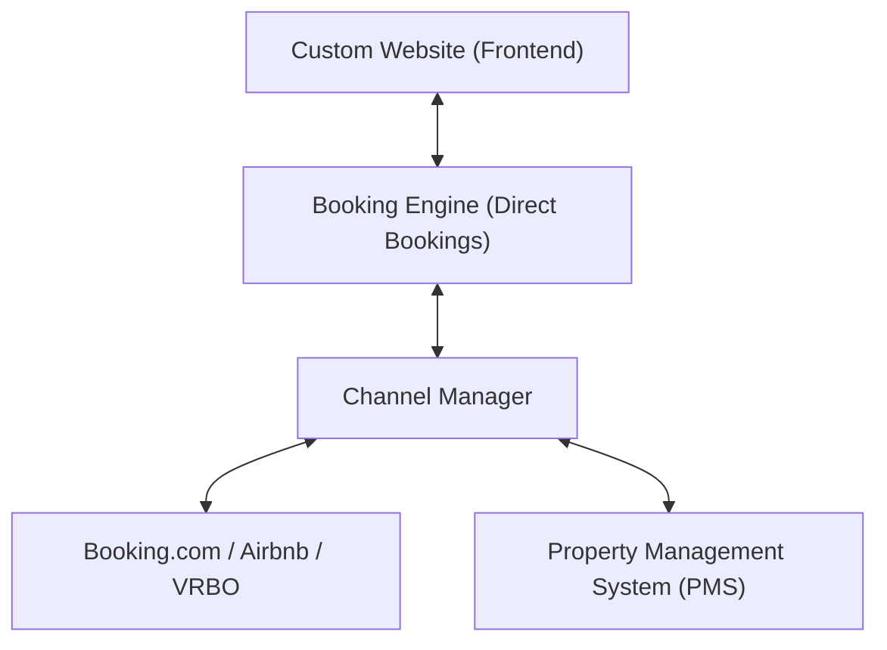

Planning a website for a hotel or rental property introduces a maze of acronyms: PMS, Channel Manager, iCal, Booking Engine, Payment Gateway. But which tools are essential — and how do you connect them without technical friction?

## The Hospitality Tech Stack Explained

### 1. Property Management System (PMS)
The PMS is the nerve center of your hospitality operation. It manages guest records, invoicing, registration forms, and overall calendar schedules.

### 2. Channel Manager
The Channel Manager acts as the synchronizer: It updates availability and rates in real-time across your PMS, custom website, and OTAs (Booking.com, Airbnb, Expedia). This eliminates the risk of double bookings.

### 3. Booking Engine
The Booking Engine is the widget or flow on your website where guests pick dates, view real-time rates, and pay securely online (via Stripe, PayPal, or credit card).

## Key Web Design Factors

The best software stack fails if the website integration feels clunky. Common pitfalls include:
- Booking calendars that break on mobile screens.
- Jarring redirects to third-party domains.
- Slow load times caused by unoptimized widgets.

We connect your existing booking tools into a seamless, high-performance website experience.

## Conclusion

You don't need to replace your current booking system to launch a modern, high-converting website. The right technical architecture connects your existing tools with an ultra-fast frontend.

Planning a hospitality project? Discover our solutions on our [Hospitality page](/en/hospitality).
