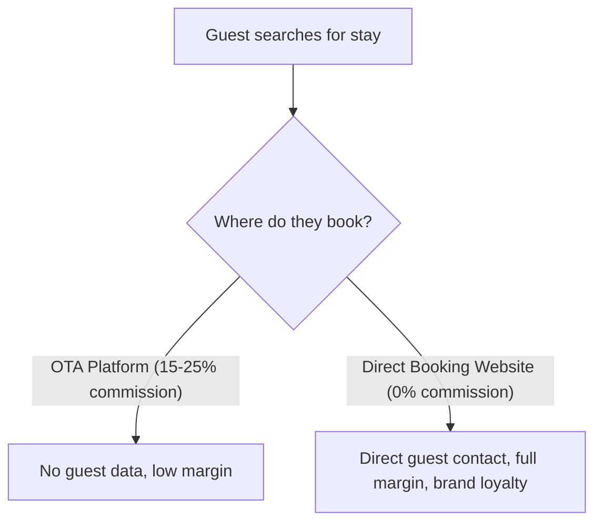

Platforms like Booking.com and Airbnb have transformed the travel industry. They offer reach, visibility, and global guests. But that reach comes with a cost: steep commissions on every booking, no direct guest relationship, and constant risk of becoming an interchangeable item in a price comparison grid.

More and more boutique hotels, vacation rentals, and villa owners are asking: How do we transition to more **direct bookings**?

## The Economics of OTA Dependency

On average, 15% to 25% of turnover flows directly to online travel agencies (OTAs) for every booking. On an annual revenue of €100,000, that equals €15,000 to €25,000 — funds missing directly from your renovation, staffing, or guest experience budgets.

A custom, professional website with an integrated booking engine eliminates these commission fees for returning guests and direct inquiries.

## The 3 Pillars of a Successful Direct Booking Website

1. **Trust Through Visual Excellence**: Guests don't just book rooms; they book an atmosphere. High-resolution imagery, smooth motion, and clear screen design build far more confidence than standardized portal grids.
2. **Seamless Booking User Experience (UX)**: If the booking flow is more cumbersome than Airbnb, guests abandon. Availability, rates, and add-ons must be crystal clear within a few clicks.
3. **Real-Time Sync via PMS & Channel Manager**: Direct booking engines should never increase manual workload. Live calendar rates must automatically sync with all channels to prevent double bookings.

## Conclusion

A direct booking website isn't meant to eliminate OTAs entirely, but to dramatically reduce your reliance on them. Every returning guest who books directly with you strengthens your margins and your brand independence.

Learn more about our dedicated solutions on our [Hospitality page](/en/hospitality).
