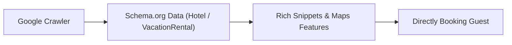

Most travelers begin their holiday research on Google, not on OTAs. Searches like "Boutique Hotel Baltic Coast", "Villa with Pool Crete", or "Luxury Apartment Berlin" carry extremely high booking intent.

Ranking in organic search results or Google's Local Pack captures guests without paid advertising or channel commissions.

## The 4 Pillars of Hospitality Local SEO

### 1. An Optimized Google Business Profile
Your Google Business Profile is your digital storefront. Up-to-date contact info, high-res photos, accurate location pins, and regular guest reviews are essential for top local pack placements.

### 2. Structured Data (Schema.org)
For Google to understand your amenities, pricing brackets, and property type, this information must be machine-readable in the code (`Hotel`, `Accommodation`, or `VacationRental` schema).

### 3. Local Content & Destination Pages
Rather than just listing room amenities, host content should answer real guest queries: local restaurant guides, travel tips, seasonal activities, and nearby highlights.

### 4. Technical Performance & Core Web Vitals
Google heavily favors mobile-first websites that load instantly. Slow template sites with heavy unoptimized images quickly drop in search visibility.

## Conclusion

Local SEO is one of the highest-ROI investments for hosts. A fast, structured website generates a continuous stream of qualified direct inquiries from organic search.

Explore how we help hospitality brands build high-visibility web presences on our [Hospitality page](/en/hospitality).
