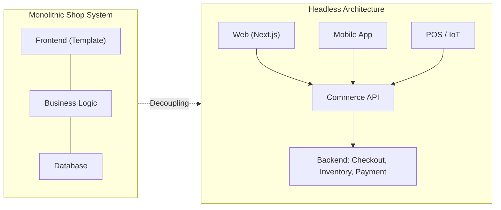

# Headless Commerce: The Paradigm Shift for Brands

For over a decade, the equation was "E-commerce = Shop System". Anyone who wanted to sell installed Shopify, Magento, or WooCommerce – and accepted that design, performance, and user experience were ultimately dictated by the limits of the template. This model isn't wrong, but it has hit a ceiling. Brands that want to differentiate themselves digitally run into the exact wall that the monolithic shop system erects: the frontend is permanently married to the backend.

Headless Commerce dissolves this marriage. And this is not a technical detail for developers, but a strategic decision that directly impacts load time, conversion rate, and brand perception.

## What "Headless" Actually Means

In a classic (monolithic) platform, the presentation layer and business logic are a single block. The backend – i.e., shopping cart, checkout, inventory, payment processing – renders the HTML page the user sees at the same time. Change the design, and you risk breaking the logic. Want to display the logic on a new channel, and you have to duplicate the frontend.

Headless separates these two worlds cleanly. The backend becomes a pure data provider that exposes its functions via an API. The frontend is a standalone application that consumes this API and freely decides how the result looks.

The crucial difference: In the monolith, there is exactly one frontend, hardwired. In the headless world, any number of frontends can connect to the same backend – web, app, POS system, voice assistant – and each can evolve independently.

## Why This Matters for Your Brand

### 1. Performance Becomes the Default

Monolithic systems must assemble a template with database queries on the server side with every page view. A headless frontend based on Next.js, on the other hand, can pre-render product pages statically (SSG) or serve them at the edge – the user receives ready-to-use HTML in milliseconds, while the dynamic parts (price, cart) are loaded in the background. Load time is no longer an afterthought, but part of the architecture.

  <svg viewBox="0 0 640 220" width="100%" role="img" aria-label="Comparison of average load times: Monolith 3.2 seconds versus Headless 0.9 seconds">
    <text x="0" y="24" fill="var(--color-text-secondary)" fontFamily="sans-serif" fontSize="14">Average load time of a product page (LCP)</text>

    <text x="0" y="86" fill="var(--color-text)" fontFamily="sans-serif" fontSize="15">Monolith</text>
    <rect x="120" y="70" width="470" height="22" rx="6" fill="var(--color-border)"/>
    <rect x="120" y="70" width="470" height="22" rx="6" fill="var(--color-chart-2)"/>
    <text x="600" y="86" fill="var(--color-text)" fontFamily="sans-serif" fontSize="15" textAnchor="end" dx="-6">3.2 s</text>

    <text x="0" y="146" fill="var(--color-text)" fontFamily="sans-serif" fontSize="15">Headless</text>
    <rect x="120" y="130" width="470" height="22" rx="6" fill="var(--color-border)"/>
    <rect x="120" y="130" width="132" height="22" rx="6" fill="var(--color-chart-1)"/>
    <text x="262" y="146" fill="var(--color-text)" fontFamily="sans-serif" fontSize="15" dx="8">0.9 s</text>

    <text x="0" y="196" fill="var(--color-text-muted)" fontFamily="sans-serif" fontSize="12">Illustrative comparison. Real values depend on implementation, hosting, and data volume.</text>
  </svg>

The connection to business outcomes is well documented: Google research shows that the probability of a bounce increases significantly when page load time goes from one to three seconds. Every tenth of a second saved is not a cosmetic win, but hard cash.

### 2. Omnichannel Without Double the Effort

Because the backend only delivers data, the same product catalog, same shopping cart, and same checkout can appear on any number of channels: website, native app, in-store display, marketplace integration, or an interface that doesn't even exist today. You maintain one backend – and serve every touchpoint.

### 3. Creative Freedom Without Technical Compromises

Perhaps the most important consequence for a brand-driven agency like us: the frontend is no longer a hostage to a theme. Micro-interactions, custom product configurators, unusual layouts, rich storytelling pages – all of this can be implemented without fighting the shop system. The digital shopping experience can be as unique as your brand identity.

## An Honest Look: When Headless Is *Not* the Right Choice

Thought leadership also means calling out the limits. Headless is not an end in itself. For a small shop with a standard catalog, a tight budget, and no need for digital differentiation, a well-configured monolith is often the smarter, more cost-effective decision. Headless unlocks its ROI where individuality, performance, multiple channels, or high scale come into play. If you don't have these requirements, you end up paying for complexity you don't use.

## How a Transition Works in Practice

A migration doesn't have to be a risky big bang. A step-by-step approach has proven most successful:

- **Audit & API Assessment:** Check if the existing backend offers a robust API or if a commerce API layer (such as an API-first provider) should be placed in front of it.
- **Frontend Rebuild:** Build the presentation layer in a modern framework, starting with the most important templates (homepage, category, product detail).
- **Incremental Rollout:** Roll out channels or page areas one after the other, instead of everything at once – this keeps the risk manageable.
- **Measurement:** Compare Core Web Vitals, conversion rates, and maintenance costs before and after to prove the ROI.

## Conclusion

Headless Commerce is not a trend, but the logical consequence of a simple realization: your brand should determine the experience, not the limits of a shop system. Decoupling frontend and backend turns performance into a default feature, makes true omnichannel cost-effective, and gives you back the creative freedom that a monolithic template takes away.

At Goldvale Studios, we build custom headless architectures that grow with your business – from API strategy to the very last pixel of the frontend.

## FAQ

**Is Headless Commerce only for large enterprises?**
No, but it is especially worthwhile if performance, custom design, multiple sales channels, or scale are important to you. For very small, standard shops, a classic system can be more economical.

**Will I lose my SEO rankings during the transition?**
Not if the migration is cleanly planned. Through server-side rendering, correct redirects, and structured data, SEO usually improves – faster load times have a positive impact on Core Web Vitals.

**Do I absolutely need Next.js for headless?**
No. Next.js is a very popular choice, but any modern frontend framework capable of consuming an API is fundamentally suitable. The key is the separation of frontend and backend, not the specific tool.
