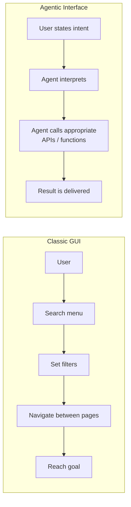

# Navigating the AI Shift in Web Architecture

Artificial Intelligence is changing the web faster than any technology since the smartphone. But the crucial shift is not that a chat box is being built in somewhere. It is about something more fundamental: the web is no longer just read by humans, but increasingly by machines – by autonomous agents, search assistants, and Large Language Models that interpret, summarize, and process content.

If you don't prepare your digital infrastructure for this new readership, you risk becoming invisible to them.

## From Click to Intent

Classic graphical interfaces force the user to find their way through menus, filters, and buttons. Interaction is bound to predefined paths. Conversational and agentic interfaces turn this around: the user states an intent, and the system finds the way.

The difference is not just convenience. An agentic interface requires an architecture where every function is cleanly addressable via an API – not buried in a template. At Goldvale Studios, we therefore integrate AI not as a superficial gimmick, but as a core component of the user experience, designed right from the architectural level.

## Structured Data is More Important Than Ever

LLMs and search agents "see" a website differently than a human. They are not interested in a pretty layout, but in meaning. If a page lacks a clean semantic structure, meaningful heading hierarchy, structured data (JSON-LD), and a clear information architecture, its content remains noise for machines at best.

This has direct consequences for visibility. Anyone who wants to be found in 2026 no longer optimizes only for classic Google search, but for a whole ecosystem of machine readers. The most important building blocks for this:

- **Semantic HTML:** Meaning through the correct elements instead of generic containers.
- **Structured Data (JSON-LD):** Explicit labeling of products, articles, FAQs, and organizations so that machines understand the context.
- **Clear Information Architecture:** A logical, hierarchical structure that can be easily crawled by machines.
- **Clean, Accessible APIs:** So that agents can not only read, but also take action.

## An Honest Look: AI is a Tool, Not a Purpose

It is tempting to build AI into everything because it is new. That is exactly the trap. A conversational interface where a simple button gets the job done faster is not progress, but friction. The measure remains the benefit for the human: AI should make a task easier – not prove that you are on the cutting edge. Those who lose this metric build impressive demos and disappointing products.

## Conclusion

The AI shift is less about new features and more about the fundamental structure. Interfaces are moving from predefined click paths to stated intents, and the web's readership is expanding from humans to machines. Both developments reward the same foundation: a clean, semantic, API-enabled architecture. The future belongs to brands whose digital infrastructure is ready to be understood by humans and crawled by machines alike.

## FAQ

**What does "optimizing for LLMs" mean in practice?**
It means structuring content so that machines can reliably capture its meaning: semantic HTML, structured data via JSON-LD, clear heading hierarchies, and a logical information architecture.

**Does AI optimization replace classic SEO?**
No, it extends it. Many fundamentals of good SEO – clean structure, fast load times, clear content – are also the foundation for good visibility with AI-powered search assistants.

**Does every website need a conversational interface?**
No. Conversational interfaces are useful where users have complex or open-ended intents. For many tasks, a classic, well-designed graphical user interface remains the faster and clearer solution.
