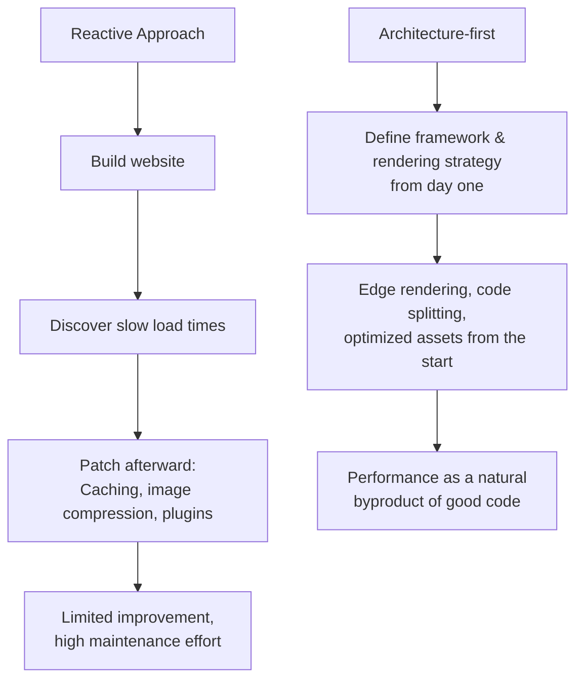

# Why Performance is Not an Option — But Part of the Brand

There is a moment that decides the success of any digital brand, and it lasts less than a second: the first page load. In this split second, the user forms an opinion – not consciously, but instinctively. If the page feels fast and fluid, this impression carries over to the entire company. If it stutters, even the best brand feels outdated and unreliable.

Performance is therefore not a technical metric to be quickly patched up at the end of a project. It is part of the brand perception – as real as your logo, your typography, and your tone of voice.

## The First Impression Happens in Milliseconds

Users unconsciously associate speed with competence. This association is deeply rooted psychologically: what responds quickly feels alive, well-maintained, and trustworthy. What hesitates raises doubts. This is exactly why load time is not just a developer topic, but a matter of brand management.

The economic effect is measurable. With every additional second of load time, the probability of a visitor staying and converting drops – a correlation proven across numerous industries.

  <svg
    viewBox="0 0 640 260"
    width="100%"
    role="img"
    aria-label="Relative conversion rate depending on load time: drops significantly as load time increases"
  >
    <text x="0" y="24" fill="var(--color-text-secondary)" fontFamily="sans-serif" fontSize="14">
      Relative Conversion Rate by Load Time
    </text>

    <line x1="60" y1="40" x2="60" y2="210" stroke="var(--color-border-strong)" strokeWidth="1" />
    <line x1="60" y1="210" x2="620" y2="210" stroke="var(--color-border-strong)" strokeWidth="1" />

    <polyline
      points="60,60 200,78 340,120 480,168 600,196"
      fill="none"
      stroke="var(--color-gold)"
      strokeWidth="3"
    />

    <circle cx="60" cy="60" r="5" fill="var(--color-gold)" />
    <circle cx="200" cy="78" r="5" fill="var(--color-gold)" />
    <circle cx="340" cy="120" r="5" fill="var(--color-gold)" />
    <circle cx="480" cy="168" r="5" fill="var(--color-gold)" />
    <circle cx="600" cy="196" r="5" fill="var(--color-gold)" />

    <text x="60" y="230" fill="var(--color-text-secondary)" fontFamily="sans-serif" fontSize="12" textAnchor="middle">1 s</text>
    <text x="200" y="230" fill="var(--color-text-secondary)" fontFamily="sans-serif" fontSize="12" textAnchor="middle">2 s</text>
    <text x="340" y="230" fill="var(--color-text-secondary)" fontFamily="sans-serif" fontSize="12" textAnchor="middle">3 s</text>
    <text x="480" y="230" fill="var(--color-text-secondary)" fontFamily="sans-serif" fontSize="12" textAnchor="middle">4 s</text>
    <text x="600" y="230" fill="var(--color-text-secondary)" fontFamily="sans-serif" fontSize="12" textAnchor="middle">5 s</text>

    <text x="0" y="252" fill="var(--color-text-muted)" fontFamily="sans-serif" fontSize="12">
      Illustrative trend. The exact decline varies by industry and device.
    </text>
  </svg>

## Core Web Vitals: Performance Becomes Measurable and Ranks

What used to be a gut feeling is now a hard metric. With Core Web Vitals, Google has established measurable thresholds that flow directly into search engine rankings. Three metrics are at the center:

- **LCP (Largest Contentful Paint):** How fast does the main content load? A value under 2.5 seconds is good.
- **INP (Interaction to Next Paint):** How fast does the page respond to user inputs? Under 200 milliseconds is good.
- **CLS (Cumulative Layout Shift):** How stable is the layout during load? Under 0.1 is good.

These values are not suggestions, but a ranking factor. Ignoring them means throwing away visibility – and with it, the most cost-effective channel: organic traffic.

## Architecture Over Optimization

The most common mistake in the industry is the order of operations. Many agencies build a website first and then try to speed it up using caching tricks, late image compression, and plugins. This is like building a house without a foundation and adding support pillars later. It helps a little – but the core problem remains.

The better way reverses the sequence: performance starts with the architecture.

At Goldvale Studios, we rely on modern frameworks like Next.js with Turbopack and Edge rendering from day one. Assets are optimized from the start, JavaScript is only loaded where needed, and content is delivered as close to the user as possible. When the foundation is right, speed is not an effort, but the default setting.

## An Honest Look: Performance is Not an End in Itself

A fast, empty page wins no one over. Speed does not replace good content or a thoughtful user experience – it amplifies them. The biggest mistake would be to chase milliseconds while forgetting the actual task: giving the user what they came for quickly *and* convincingly. Performance is the stage, not the play.

## Conclusion

Load time is not a technical afterthought, but a brand signal. It decides the first impression, the conversion rate, and search visibility. Those who understand performance as an integral part of the architecture – rather than a post-launch repair – build platforms that are faster, rank better, and simply look more professional.

At Goldvale Studios, web performance is not a "nice-to-have", but the foundation on which everything else stands. Especially in hospitality, load speed directly drives direct bookings — learn more on our [Hospitality page](/en/hospitality).

## FAQ

**What are good Core Web Vitals scores?**
Good scores are an LCP under 2.5 seconds, an INP under 200 milliseconds, and a CLS under 0.1. These thresholds directly impact your Google ranking.

**Can a slow website be made fast after the fact?**
Partially. Caching and image optimization help, but they hit a ceiling if the core architecture is not designed for performance. Often, rebuilding the frontend is more economical than continuous patching.

**Does performance really affect revenue?**
Yes. Faster load times measurably reduce bounce rates and increase conversion rates – this effect has been proven across many industries.
