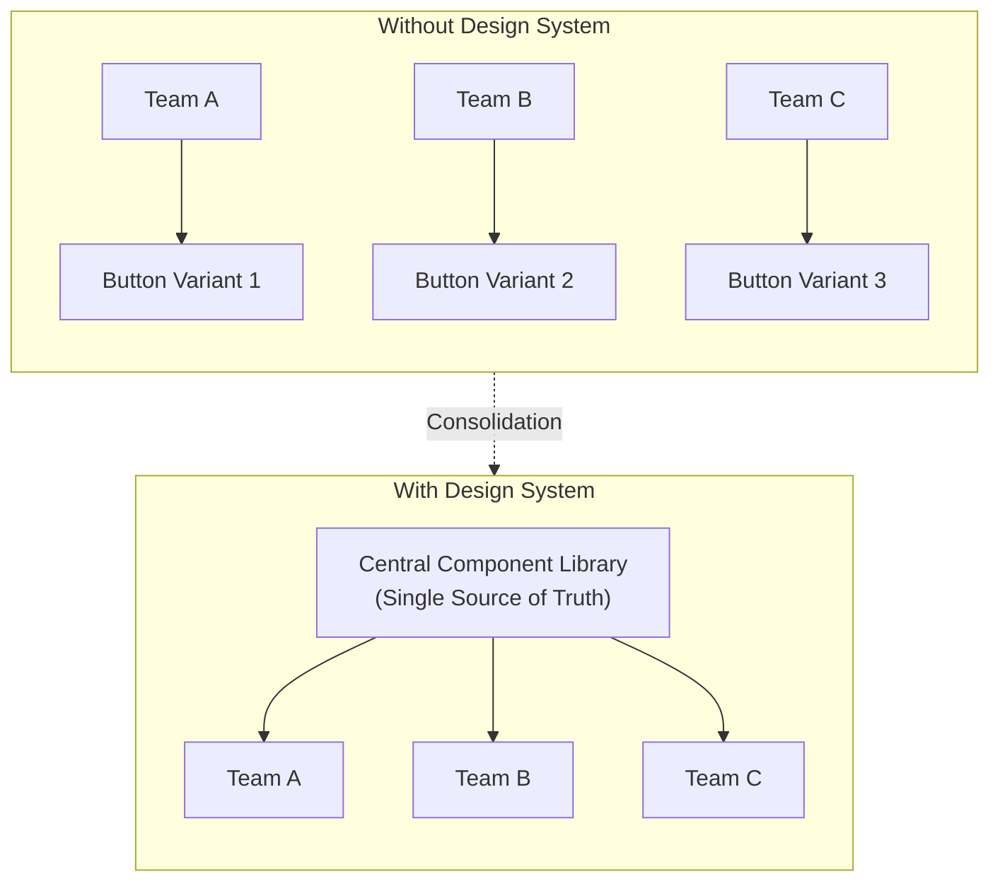

# Scaling Consistency: The True ROI of Design Systems

When companies grow, their digital coherence rarely grows with them. One team builds the new landing page, another the internal web app, a third the customer portal. Each makes its own decisions. The result: buttons look different in three places, spacing varies, typography drifts apart – and the user experience feels like three different brands rather than one.

This fragmentation is not a cosmetic issue. It costs time, money, and trust. A design system is the answer – and its ROI can be quantified.

## Fragmentation: The Invisible Leak

Without a central source, chaos ensues. Each department develops its own version of the same component, and with every variation, the maintenance effort grows while the brand perception erodes.

In the state on the left, every team multiplies complexity. On the right, everyone shares the same foundation – a change in a central place takes effect everywhere.

## The Design System as a Single Source of Truth

A design system is far more than a UI kit in Figma. It is a coded library of real, production-ready components – for example in React and Tailwind – used by designers and developers alike. The crucial point: design and code share the same truth, rather than being two separate worlds that must be painstakingly kept in sync.

When we implement a design system at Goldvale Studios, we ensure that a change to the brand color is defined in exactly one place – and automatically propagates across all digital products. No manual updates, no forgotten pages.

## The ROI is Measurable

The benefit of a design system does not remain vague. It shows up in concrete metrics:

- **Faster Time-to-Market:** New features are no longer designed "from scratch" but assembled from vetted components. What used to take days now takes hours.
- **Fewer Bugs:** Central, well-tested components drastically reduce error rates – a problem solved once remains solved.
- **Lower Maintenance Costs:** Updates are made in one place instead of dozens.
- **Seamless Brand Perception:** The user feels that they are moving through the same ecosystem throughout – this builds trust.

## An Honest Look: A Design System is an Investment, Not a Self-Runner

A design system does not pay off from day one. Building it takes time, and for a very small team with a single product, the overhead may initially exceed the benefits. Equally dangerous is a system that is built but not maintained – it becomes outdated and is quickly bypassed. The ROI comes from scaling and from discipline in maintenance, not from the mere existence of a component library.

## Conclusion

Consistency across multiple products and teams is not a coincidence, but the result of a systematic architecture. A design system turns scattered individual decisions into a shared foundation, speeds up development, reduces errors and costs, and holds the brand together across all touchpoints. For growing companies, it is therefore less of a design issue and more of a strategic infrastructure decision.

## FAQ

**At what size does a design system become worthwhile?**
As soon as multiple products or multiple teams work on the digital presence in parallel. For a single small product, the effort may initially outweigh the benefits.

**Is a design system the same as a component library in Figma?**
No. The Figma library is the design part. A complete design system also includes the coded, production components as well as guidelines, so design and code share the same source.

**How do you keep a design system up-to-date in the long term?**
Through clear ownership, versioning, and a defined process for how new components are added and existing ones are modified. Without maintenance, any system becomes obsolete.
