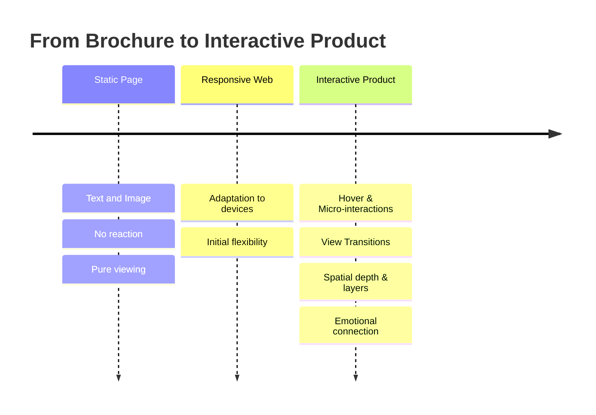

# The End of the Static Page: Web Experiences That Breathe

Do you remember the websites of the past? Deserts of text and images that were basically nothing more than digitized brochures – a flyer lifted onto the internet. They informed, but they did not respond. They were there, but they weren't alive.

Those days are over. Users today no longer expect documents, but experiences. A website is no longer a page to look at, but a product to interact with.

## From Layout to Interaction

The difference between a static page and a living product lies in the response. An excellent digital product answers the user: a subtle hover effect confirms that an element is clickable. A seamless transition when changing pages (View Transitions) preserves context. A micro-interaction provides feedback that an action has been received.

The emphasis is on *subtle*. It is not about overloaded animations that distract from the content, but about feedback that provides guidance. Good interaction is not noticed consciously – it is only missed when it is absent.

## Space and Depth

The web has long ceased to be a flat sheet of paper. With modern CSS features like `backdrop-filter` (glassmorphism) and soft, organic shadows, depth can be created to convey hierarchy and focus. Layers place themselves above and behind each other, and the user intuitively grasps what is in front and what is in the back.

Another tool is targeted scroll-telling: content reveals itself in step with the scroll movement, telling a story without overwhelming the user all at once. Motion becomes choreography – not an end in itself.

## An Honest Look: Motion Requires Restraint

Here lies the greatest danger. As soon as animation becomes an end in itself, the experience flips into its opposite: load times increase, operation becomes sluggish, and users with motion sensitivities are excluded. That's why every animation must be questioned about its purpose – and technical considerations, such as respecting `prefers-reduced-motion`, must be implemented. An experience that breathes is not one that is constantly fidgeting. Restraint is a quality feature here, not a lack of ambition.

## Conclusion

The static page has served its purpose because it no longer delivers what users expect: a relationship. Motion, depth, and fine feedback transform a passive document into a responsive product – and that builds emotional connection. The decisive factor is the attitude: not animation at all costs, but targeted interaction that serves the content. Anyone who still designs their website like a flyer is throwing away this exact connection.

## FAQ

**Do animations not slow down the website?**
Poorly implemented ones do, yes. Well-implemented interactions use GPU-accelerated CSS properties and are barely noticeable. The key is a sparse, targeted application instead of showy effects.

**What about users who find motion disturbing?**
Modern implementations respect the system setting `prefers-reduced-motion` and automatically reduce or disable animations. Accessibility is not an optional add-on, but a duty.

**Does every website really need complex interaction?**
No. The right measure depends on target audience and purpose. A government or documentation site lives from clarity, a brand presence from experience. Interaction should serve the goal, not obscure it.
