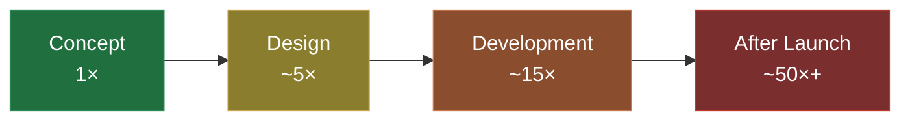

# The Invisible Value of UX Research

Many projects start with a grand vision. Weeks of design, months of coding – and at launch, shockingly little happens. Users don't understand the product, can't find the key function, or drop out during checkout. The cause is rarely in the execution. It lies at the beginning: decisions were based on assumptions instead of knowledge.

UX research closes exactly this gap. It is the discipline of replacing guessing with observing – and thereby preventing the most expensive line of code: the one written for a feature that nobody needs.

## Why Research is Cut First – and Why That is a Fallacy

UX research is frequently the first item to drop out of the budget. The reason: it seemingly delivers "no tangible output". You don't see an interface, a finished feature, or anything to show off. This perception is understandable – and expensive.

Because the value of research is not what is created by it, but what is *not* created by it: the wrong feature, the unnecessary development sprint, the support wave after launch. These costs never show up in any project plan because they remain invisible when research prevents them.

## The Economics of the Early Mistake

A mistake in the concept phase costs almost nothing if corrected there. The same mistake costs many times more if it is only noticed after launch – by then it is embedded in design, code, database, and documentation. This cost curve is one of the most robust findings in product development.

The numbers are illustrative, but the order of magnitude is real: the later an error is discovered, the more expensive it is to fix. UX research shifts discovery to the very front – to where corrections are almost free.

## Prototyping Before Programming

At Goldvale Studios, we rely on rapid prototyping and real user feedback before we write a single line of production code. A clickable prototype can be built in days and tested in hours – a finished feature takes weeks. Vetted methods include:

- **Usability Testing:** Real users try to solve a typical task. Where they stumble, there is a problem – not an argument over opinion, but an observation.
- **User Interviews:** They uncover motivations and mental models that analytics data alone would never reveal.
- **Heatmaps & Session Recordings:** They show where users actually click and scroll – often surprisingly different from what was planned.
- **A/B Testing:** Replacing debates about taste with solid data.

## An Honest Look: Research Does Not Replace Decisions

UX research delivers insights, not ready-made answers. Anyone expecting tests to automatically answer every design question will be disappointed. The art lies in interpretation – and in the willingness to accept uncomfortable results. Research whose results you only want to see confirmed is a wasted budget. The value only arises when you are ready to be surprised by the outcome.

## Conclusion

UX research feels like a cost item but is actually an insurance policy against the most expensive mistakes in product development. It turns assumptions into knowledge, shifts corrections to the cheap early phase, and ensures that you end up with a product that solves real problems. The result: higher adoption, fewer support queries, and users who understand what they came for.

## FAQ

**How many users do you need for a meaningful usability test?**
For qualitative testing, five users are often enough to uncover the majority of major usability issues. For quantitative results (like A/B testing), much larger sample sizes are needed.

**Is UX research worth it for small projects?**
Yes. Especially with a tight budget, it is particularly painful to invest resources in the wrong feature. Even lightweight methods like short prototype tests bring great value here.

**Is UX research the same as market research?**
No. Market research asks *if* there is a demand. UX research investigates *how* people actually use a specific product and where they fail in the process.
